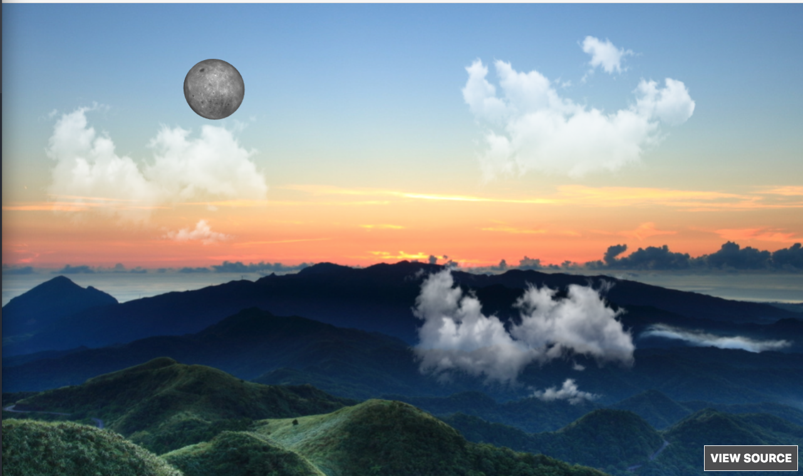

# Moon View

This is a project build to test out the three.js 3D framework.

It is a simple scene of a sunset where the moon is showing and clouds are floating on top.

If you click on the scene you can add more clouds in random places with different moving speeds.

### Note
Since this project is using the three.js framework, not every computer can handle the load of of this library.

[Live preview](joseplatas.com/project/moon_view)
